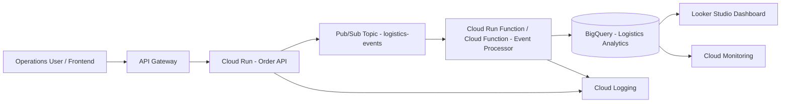

# Event-Driven Logistics Platform on Google Cloud

A portfolio-ready reference architecture for a logistics order-tracking platform using an event-driven pattern on Google Cloud

This repository is designed for **Presales, Cloud Architect, and Solution Architect** portfolios. The value is not only the sample API, but the complete solution package: cloud architecture, event model, Terraform, CI/CD, BigQuery analytics, Looker Studio dashboard guide, cost estimation, and operational runbook.

## Business Use Case

A logistics company wants to monitor order status across pickup, in-transit, delayed, delivered, and cancelled states. The business needs near-real-time visibility into delivery performance, delay reasons, SLA achievement, route performance, and branch-level operations.

## Target Architecture



## What This Repo Contains

```text
services/order-api/            FastAPI backend designed for Cloud Run
functions/event-processor/     Pub/Sub event processor for BigQuery ingestion
frontend/mock/                 Lightweight frontend mockup
infra/terraform/               GCP infrastructure as code sample
sql/bigquery/                  Tables, views, and dashboard queries
data/sample/                   Dummy order and event payloads
scripts/                       Local simulation and data generation scripts
dashboard/                     Excel dashboard mockup and preview artifact
docs/                          Architecture, ADR, cost, security, ops, presales docs
.github/workflows/             CI checks for Python and repository hygiene
```

## Core Features

- Dummy order tracking API
- Event-based status update publishing to Pub/Sub
- Pub/Sub-triggered event processor
- BigQuery analytics schema and dashboard queries
- KPI dashboard mockup
- Looker Studio dashboard guide
- Terraform sample for Cloud Run, Pub/Sub, BigQuery, IAM, API Gateway placeholder, and budget alert
- Architecture Decision Records
- Security and cost estimation documentation

## Example Event Payload

```json
{
  "event_id": "evt-10001",
  "order_id": "ORD-2026-0001",
  "event_type": "ORDER_STATUS_UPDATED",
  "status": "IN_TRANSIT",
  "branch": "Jakarta Hub",
  "route": "JKT-BDG",
  "driver_id": "DRV-001",
  "sla_minutes": 1440,
  "actual_minutes": 1325,
  "event_timestamp": "2026-06-11T09:30:00Z"
}
```

## Local API Run

```bash
cd services/order-api
python -m venv .venv
source .venv/Scripts/activate  # Git Bash on Windows
pip install -r requirements.txt
uvicorn app.main:app --reload --port 8080
```

Open:

```text
http://localhost:8080/docs
```

## Sample Request

```bash
curl -X POST http://localhost:8080/orders/ORD-2026-0001/status \
  -H "Content-Type: application/json" \
  -d '{
    "status": "IN_TRANSIT",
    "branch": "Jakarta Hub",
    "route": "JKT-BDG",
    "driver_id": "DRV-001",
    "sla_minutes": 1440,
    "actual_minutes": 1325
  }'
```

By default, local mode prints the event to logs. Set `PUBSUB_TOPIC` and Google Application Default Credentials to publish to Pub/Sub.

## Suggested GitHub Repository Description

```text
Event-driven logistics platform reference architecture on GCP using Cloud Run, API Gateway, Pub/Sub, Cloud Functions, BigQuery, Looker Studio, Terraform, and dashboard analytics.
```

## Portfolio Positioning

This project demonstrates the ability to:

1. Translate logistics business requirements into cloud architecture.
2. Design an event-driven platform for scalable order tracking.
3. Build a small but realistic API and event processor.
4. Model analytics in BigQuery for operational dashboards.
5. Explain security, cost, SLA, and operational considerations.
6. Present a presales-ready solution blueprint.

## Disclaimer

All data is dummy data. No real customer data, credential, API key, or production configuration is included.
