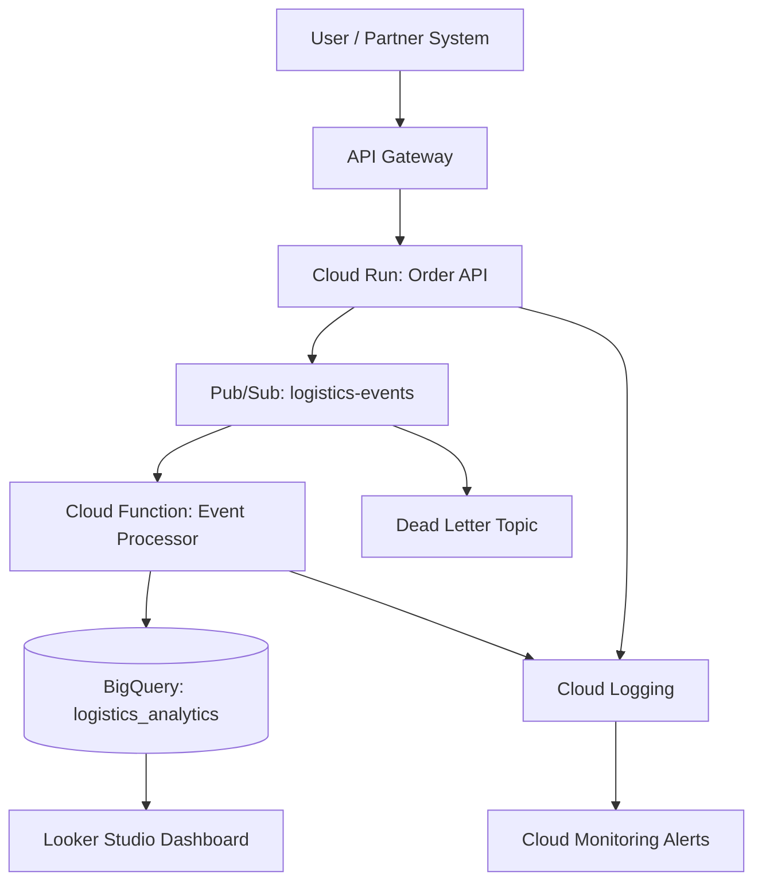

# Architecture Overview

## Objective

Design a logistics order tracking platform that can receive operational events, decouple workloads, process events asynchronously, and expose analytics for operational leaders

## High-Level Flow

1. Operations users or external systems send order status updates through a frontend or API client
2. API Gateway protects and routes traffic to the Cloud Run order API
3. Cloud Run validates the request and publishes an event to Pub/Sub
4. A Cloud Function or Cloud Run function processes the event
5. Processed event records are stored in BigQuery
6. Looker Studio connects to BigQuery for performance dashboards

## Logical Architecture

## Key Design Principles

- **Event-driven:** Order updates are represented as immutable events
- **Decoupled:** API availability is separated from downstream analytics processing
- **Serverless-first:** Cloud Run and Cloud Functions reduce infrastructure operations
- **Analytics-ready:** BigQuery stores partitioned and clustered event data
- **Cost-aware:** Scale-to-zero and partitioned analytics reduce baseline cost

## Production Enhancements

- Add API Gateway authentication and quota policies
- Enable Pub/Sub dead-letter topic and retry policies
- Add Cloud Armor if the public endpoint is exposed through a load balancer
- Add VPC Service Controls for sensitive analytics environments
- Add CI/CD approval gates for production
